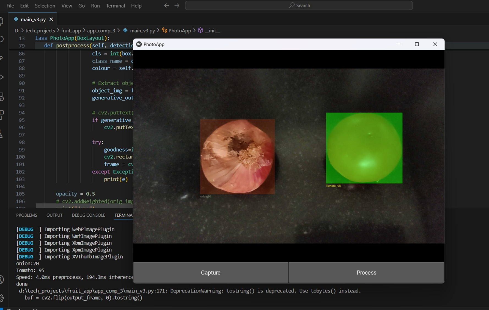

# Fruit & Vegetable Freshness Detection App

This app detects whether a fruit or vegetable is fresh or not based on images captured using a Kivy-based camera application. The application uses the YOLOv8s model for object detection to identify fruits and vegetables in the captured image. Once the objects are detected, the app sends the detected objects to a multimodal LLM (Large Language Model) to determine if the fruit or vegetable is fresh or not.

## Features
- **Object Detection:** Uses the YOLOv8s model to detect fruits and vegetables in images captured by the camera.
- **Freshness Analysis:** A multimodal LLM model evaluates the freshness of detected objects based on image features and predefined criteria.
- **Kivy Interface:** A user-friendly interface built using the Kivy framework to capture images and display results.

## Requirements
- Python 3.x
- Kivy
- YOLOv8s model (ONNX format recommended for compatibility)
- Pretrained multimodal LLM model (for freshness classification)
- OpenCV or other image processing libraries

## Installation

1. Clone the repository:
    ```bash
    git clone https://github.com/your-username/fruit-vegetable-freshness-detection.git
    cd fruit-vegetable-freshness-detection
    ```

2. Install the dependencies:
    ```bash
    pip install -r requirements.txt
    ```

3. If you haven't already, download the YOLOv8s model and place it in the `models/` directory.

## Usage

1. Run the app:
    ```bash
    python app.py
    ```

2. Capture an image of a fruit or vegetable using the Kivy interface.

3. The app will detect the objects in the image and then use the multimodal LLM to analyze if the detected items are fresh.

4. The freshness status will be displayed on the screen.

## Contributing

Feel free to fork the repository, create a branch, and submit a pull request with your improvements or fixes. Contributions are welcome!

## License

This project is licensed under the MIT License - see the [LICENSE](LICENSE) file for details.

## Acknowledgements
- YOLOv8s for object detection
- Kivy for the mobile interface
- [Multimodal LLM model](#) for freshness classification

## Image


